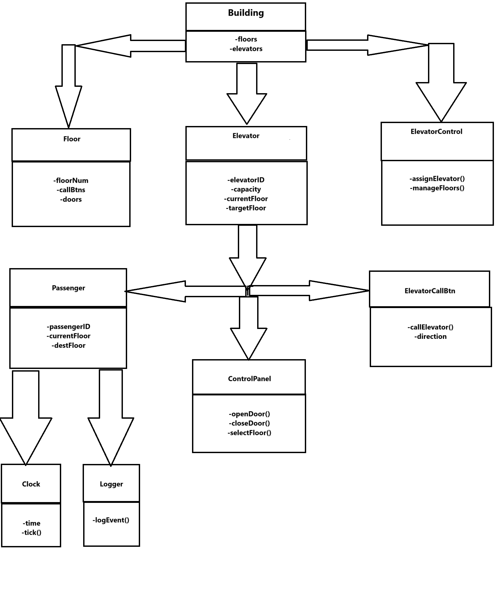

# 🏢 Elevator Management System

Bu sistem için UML sınıf diyagramı tasarlayalım.

---

### 🚪 Sistem Açıklaması

1. 🛗 **Building (Bina)** sınıfı, katları ve asansörleri yönetir.
2. 🛗 **Floor (Kat)** sınıfı, her katta kapılar, çağrı düğmeleri ve sinyalleri içerir.
3. 🛗 **Elevator (Asansör)**, binadaki 5 asansörü temsil eder ve her biri katlar arasında yolcu taşır.
4. 🛗 **ControlPanel (Kontrol Paneli)**, asansör içindeki düğmeleri yönetir.
5. 🛗 **ElevatorCallButton (Asansör Çağrı Düğmesi)**, yukarı/aşağı çağrıları yönetir.
6. 🛗 **Passenger (Yolcu)**, rastgele katlara gitmek için oluşturulur ve asansör çağırır.
7. 🛗 **ElevatorController (Asansör Kontrol Sistemi)**, asansörleri en uygun şekilde yönlendirir.
8. 🛗 **Clock (Saat)**, simülasyon zamanını takip eder ve olayları tetikler.
9. 🛗 **Logger (Günlük Kaydı)**, asansör hareketleri ve yolcu işlemlerini kaydeder.

---

Bu yapı, Encapsulation (Kapsülleme), Inheritance (Kalıtım), Polymorphism (Çok Biçimlilik) ve Abstraction (Soyutlama) prensiplerine uygundur.

---

