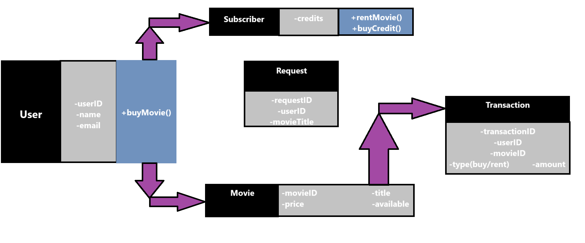

# 🎬 Online Film Sell And Rent Management

Online film satan veya kiralayan uygulamanın sistemini tasarlayın.

---

- 🍿 Uygulamada filmler listelenebilir, sıralanabilir ve kullanıcılar uygulamaya abone olabilir.
- 🍿 Kullanıcılar abonelik için sistem üzerinden kredi satın alır.
- 🍿 Sadece abone olan kullanıcılar, kredileri ile film kiralayabilir ve kiraladığı filmin kredi bedeli kadar hesabından düşülür.
- 🍿 Normal kullanıcılar ve aboneler film satın alabilirler.
- 🍿 Eğer film mevcut değil ise talep edilebilir.

---

